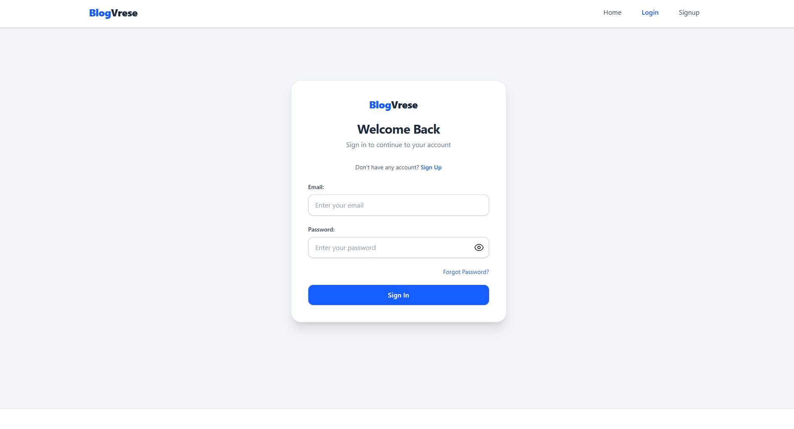
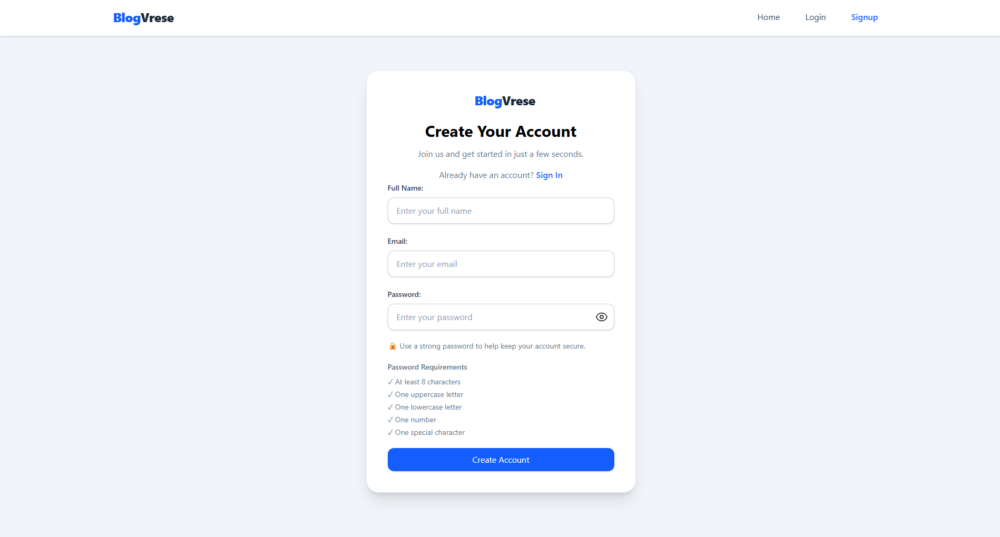
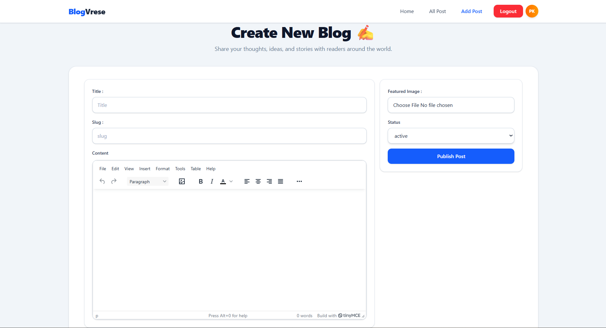

# BlogVerse 🚀

A modern full-stack blogging platform featuring secure authentication, email verification, password recovery, rich text editing, image uploads, and post management built with React, Redux Toolkit, React Hook Form, React Router DOM, Appwrite, TinyMCE, and Tailwind CSS.

## ✨ Key Features

### Authentication

* User Signup
* User Login
* Logout
* Email Verification
* Forgot Password
* Reset Password
* Password Visibility Toggle
* Email Verification Protection
* Verification Email Resend Flow
* Secure Password Recovery
* Protected Login for Verified Users

### Blog Management

* Create Post
* Edit Post
* Delete Post
* View Single Post
* View All Posts
* Featured Image Upload
* Automatic Image Deletion
* Rich Text Editor (TinyMCE)

### User Experience

* Responsive Design
* Mobile-Friendly Navigation
* Avatar Dropdown Menu
* Dynamic User Avatars
* Protected Routes
* Loading States
* Form Validation
* Author Information
* Post Creation Date Display

### Security

* Route Protection using AuthLayout
* Email Verification Required Before Login
* Password Recovery Flow
* Session Management with Appwrite

## 🛠️ Tech Stack

### Frontend

* React
* React Router DOM
* Redux Toolkit
* React Hook Form
* Tailwind CSS
* TinyMCE Editor

### Backend & Services

* Appwrite Authentication
* Appwrite Database
* Appwrite Storage

### Deployment

* Vercel

---

## 📂 Project Structure

```bash

blogverse
│
├── screenshots
│   ├── home.png
│   ├── login.png
│   ├── signup.png
│   ├── all-posts.png
│   ├── create-post.png
│   └── single-post.png
│
├── src
│   │
│   ├── appwrite
│   │   ├── auth.js
│   │   ├── bucketService.js
│   │   └── dbService.js
│   │
│   ├── components
│   │   ├── AuthLayout
│   │   ├── Button
│   │   ├── Container
│   │   ├── Footer
│   │   ├── Header
│   │   ├── Input
│   │   ├── Login
│   │   ├── Logo
│   │   ├── LogoutBtn
│   │   ├── PostCard
│   │   ├── PostForm
│   │   ├── RTE (TinyMCE Editor)
│   │   ├── ScrollToTop
│   │   ├── Select
│   │   ├── SignUp
│   │   └── index.js
│   │
│   ├── conf
│   │   └── conf.js
│   │
│   ├── features
│   │   └── authSlice.js
│   │
│   ├── pages
│   │   ├── AddPost.jsx
│   │   ├── AllPost.jsx
│   │   ├── CheckEmail.jsx
│   │   ├── EditPost.jsx
│   │   ├── ForgotPassword.jsx
│   │   ├── Home.jsx
│   │   ├── Login.jsx
│   │   ├── Post.jsx
│   │   ├── ResetPassword.jsx
│   │   ├── SignUp.jsx
│   │   ├── VerifyEmail.jsx
│   │   ├── VerifyPending.jsx
│   │   ├── VerifySuccess.jsx
│   │   └── index.js
│   │
│   ├── store
│   │   └── store.js
│   │
│   ├── utils
│   │   └── AvatarColor.jsx
│   │
│   ├── App.jsx
│   ├── main.jsx
│   └── index.css
│
├── README.md
├── package.json
└── vite.config.js
```

---

## ⚙️ Environment Variables

Create a `.env` file in the root directory and add:

```env
VITE_APPWRITE_URL=
VITE_APPWRITE_PROJECT_ID=
VITE_APPWRITE_DATABASE_ID=
VITE_APPWRITE_TABLE_ID=
VITE_APPWRITE_BUCKET_ID=
VITE_TINYMCE_API_KEY=
```

## 🚀 Installation

Clone the repository:

```bash
git clone https://github.com/Pankaj2299/blogverse.git
```

Navigate to project folder:

```bash
cd blogverse
```

Install dependencies:

```bash
npm install
```

Run development server:

```bash
npm run dev
```

Build for production:

```bash
npm run build
```

## 🔐 Authentication Flow

1. User creates an account
2. Verification email is sent
3. User verifies email
4. User can log in
5. Forgot password and reset password supported

## 🌐 Live Demo

   [Visit BlogVerse](https://blogverse-rho.vercel.app/)

   ---

   ## 📸 Screenshots

### Home Page


### Login Page



### Signup Page



### All Posts


### Create Post



### Single Post


 ---

## 📱 Responsive Design

* Desktop Navigation
* Mobile Avatar Menu
* Responsive Layout
* Optimized User Experience

---

## 👨‍💻 Author

**Pankaj Kumar**

📧 Email: Pankajkumar199922@gmail.com
<br>
🔗 GitHub: https://github.com/Pankaj2299
<br>
🔗 LinkedIn: https://www.linkedin.com/in/pankaj-kumar-4b3276266

---

